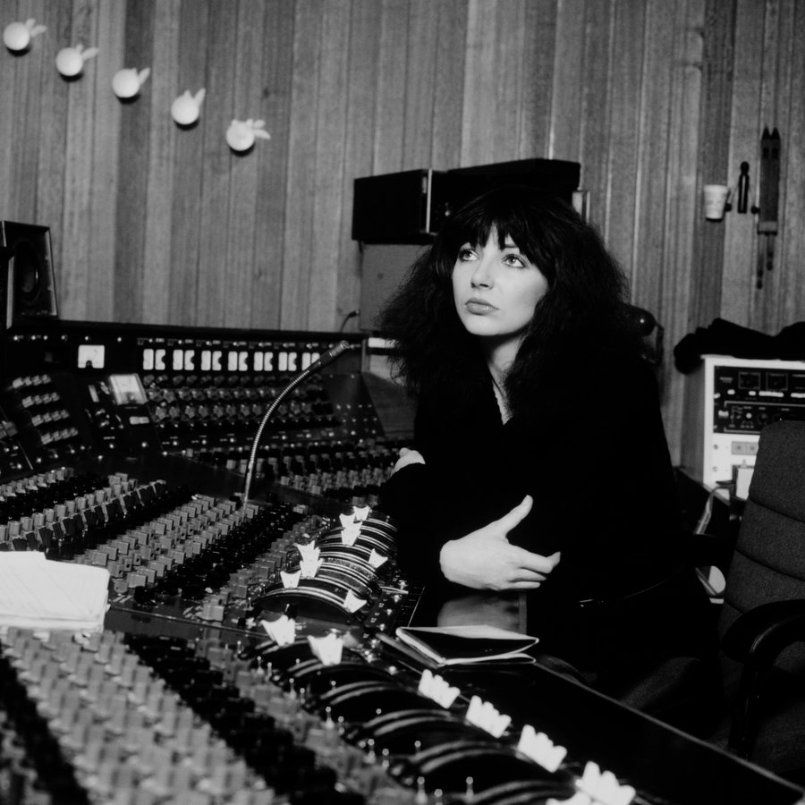

Students learn technical skills of the recording studio and use studio sessions extensively under real world situations, taking responsibility for most studio functions, such as engineering, producer, studio tech, and studio manager.
