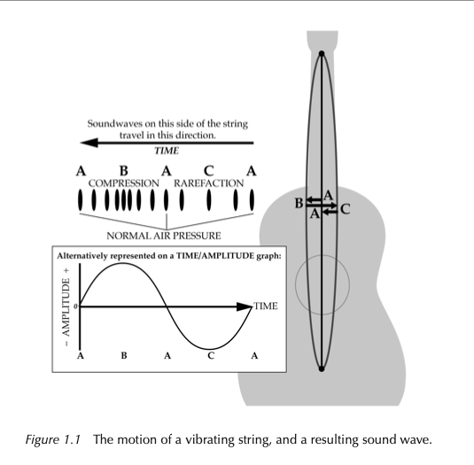
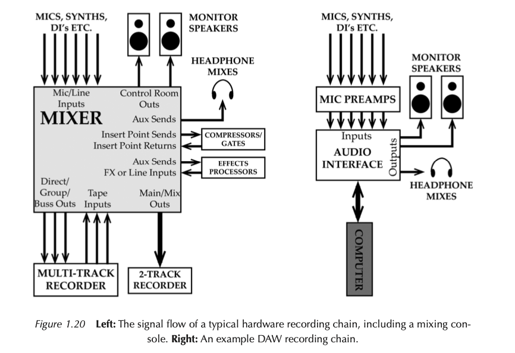
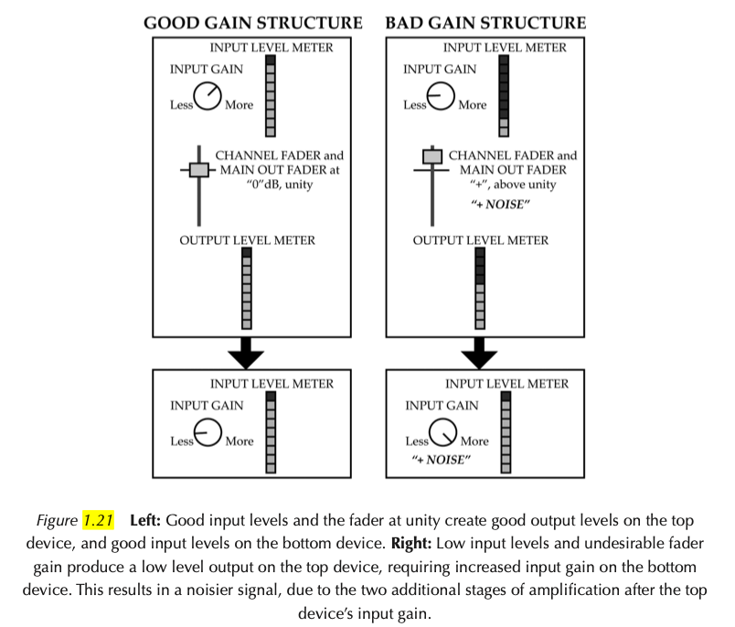

+++
title = "Audio Basics"
outputs = ["Reveal"]
[logo]
src = "github-logo.png"
[reveal_hugo]
custom_theme = "reveal-hugo/themes/robot-lung.css"
margin = 0.2
separator = "##"
+++

# Audio Basics

---

## The Importance of Understanding Sound

- The Limitation of Gear Alone
- Sound as an Artistic Medium
- The Value of Audio Theory and Studio Basics
- Potential Impact on Recording and Mixing Quality

{}

- Having the latest audio equipment is exciting, but it's not a guarantee of great sound. Understanding how to use equipment effectively is key.
- Sound engineers use sound as their canvas, creating sonic art. Understanding sound helps in predicting its behavior, leading to better recordings.
- Grasping fundamental audio theory and studio basics is crucial. It enhances the ability to make the most out of the concepts and techniques in sound production.
- Knowledge from this chapter might alter your perspective on sound, improve equipment usage, and enhance the quality of the audio you record and mix.

{}

---

{}

- Sound is produced by vibrating objects like guitar strings, wind instrument reeds, or drum heads. These vibrations create variations in air pressure, forming sound waves.
- As an example, a vibrating guitar string alternates between compressions (increased air pressure) and rarefactions (decreased air pressure), propagating sound waves.
- The speed of sound, approximately 344 meters per second at 20°C and sea level, varies with air temperature, altitude, and humidity.
- Sound can be graphically represented through the spacing of air molecules (air pressure) and time/amplitude graphs, resembling the complex harmonic waveforms captured by microphones.

{}

---

## The Decibel (dB)

## Understanding Decibels in Audio

- Decibel (dB): Measurement of Sound Energy
- dB in Audio Equipment: A Must-Know for Proper Use
- dB Scale: Simplifying Large Ranges into Manageable Numbers
- dB as a Logarithmic Unit: Representing Power Ratios

{}

- Decibels quantify the amplitude or intensity of sound, a fundamental aspect in audio engineering.
- Learning the dB scale is essential for correctly operating audio meters, faders, and equipment knobs.
- The dB scale efficiently compresses a wide range of values, like watts in power measurement, into a more practical scale for everyday use.
- Decibels are logarithmic, meaning they represent large ranges of power ratios in a condensed, understandable format. It's crucial to specify the reference point (e.g., dB SPL, dBm) for clarity.

{}

---

## Power relationships

[Audio examples](https://routledgetextbooks.com/textbooks/9780367470364/audio_files.php)

- Sound Pressure Level (SPL): Measurement of Loudness
- Impact of Power Changes on SPL
- Voltage and Perceived Loudness Relationship
- Practical Application in Audio Mixing

{}

- SPL is a measure of a sound's loudness at a specific location. It's key in audio engineering.
- Doubling sound power increases SPL by 3 dB, perceived as slightly louder. Halving it decreases SPL by 3 dB, perceived as slightly quieter.
- Doubling the electrical voltage of a sound results in a 6 dB increase but doesn't double its perceived loudness. For a sound to be perceived as twice as loud, a 9 or 10 dB increase is needed.
- These principles apply to all dB-scaled controls in audio equipment. For example, increasing the vocal fader level by +3 dB makes the vocal slightly louder, while reducing the sax fader level by −9 dB makes it half as loud. This understanding leads to more precise and professional adjustments in audio mixing.

{}

---

## Decibel Scales

- dB SPL: Measuring Environmental Loudness
- dBV: Voltage Representation in Audio Equipment
- dBu: Averaged Amplitude on VU Meters
- dBFS: Peak Measurement in Digital Audio
- dBTP: True Peak Accounting for Inter-Sample Peaks
- LUFS: Perceived Loudness Measurement

{}

- dB SPL measures actual loudness in an environment, ranging from the threshold of hearing (0 dB SPL) to the threshold of pain (around 130 dB SPL).
- dBV, used in analog and emulated digital devices, measures electrical voltage representing sound waves. It’s a peak meter scale with "0" as the optimal operating level.
- dBu, found on Volume Unit (VU) meters, shows an averaged sound intensity, suitable for analog devices where exceeding "0" dBu is acceptable.
- dBFS, common in digital audio devices, indicates instantaneous peak levels with "0 dBFS" as the maximum amplitude without distortion.
- dBTP addresses inter-sample peaks that might occur in digital to analog conversion or lossy format encoding, indicating true peak levels.
- LUFS meters, reflecting human perception of loudness, are crucial for audio mixing and mastering, especially for content on music streaming services.

{}

---

### Signal Flow

{}

- Signal flow is the path an audio signal takes through various devices during recording or playback. Knowing it aids in troubleshooting and improves professionalism.
- 
{}

---

## Audio Level Standards 

- Microphones and Mic Levels
- Line Levels and Standards
- Routing and Recording Techniques
- Loudspeaker and Instrument Levels

{}

- Microphones convert sound to electrical signals (mic level). Preamps amplify these signals to line level for further processing in mixing consoles or interfaces.
- Line levels have two standards: +4 dBu (professional level) and -10 dBV (consumer level). Connecting mismatched levels can lead to distortion or noise.
- In a studio setup, signals from mics or instruments are routed for direct stereo recording or multi-track recording, with outputs returning to mixing consoles or DAWs.
- Loudspeaker level (for passive speakers) requires amplification from line level. Electric guitars and basses use instrument level and may need DI boxes for proper impedance matching.

{}

---

## Gain Structure and Recording Levels

- Importance of Proper Level Setting
- Mic Level Management
- Digital Recording: Avoiding Clipping
- Analog Recording: Characteristic Distortion
- Monitoring Levels and Peak Indicators

{}

- Setting appropriate levels in the recording chain is crucial for clean recordings. Incorrect levels can introduce noise, hiss, or distortion.
- Microphones lack gain controls, relying on preamp gain adjustments to reach optimal line level.
- In digital recording (dBFS scale), avoiding clipping is paramount. Modern 24 and 32-bit systems offer more headroom, allowing for safer recording levels.
- Analog devices can handle levels exceeding "0" dBV, often enhancing the unit's character. However, care is needed to avoid triggering overload indicators.
- Monitoring levels is different for digital and analog systems. VU meters, common in analog, show average levels, while digital meters display instantaneous peak levels. Proper monitoring ensures desirable sound quality without distortion.

{}

---

---

## Analog Audio Connectors in Recording

- XLR Connectors: Preferred for Single Channel Analog
- Quarter-Inch Phone Connectors: TRS and TS Varieties
- Balanced vs Unbalanced Connections
- RCA/Phono Connectors: Common in Consumer Gear
- Patchbays: Bantam/TT and Quarter-Inch Military Connectors
- 25-PIN D-Sub Connectors: Multi-Channel Audio Transport
- Eighth-Inch TRS Connectors: Not Ideal for Professional Audio

{}

- XLR connectors, locking and durable, are standard for microphones and line connections. They feature male (pins) and female (holes) types for directional signal flow.
- Quarter-inch connectors are split into TRS (three segments) for balanced line-level and TS (two segments) for instrument-level or some speaker connections.
- Balanced connections (using XLR or TRS) reduce interference and allow longer cables. Unbalanced connections (like RCA or TS) are more susceptible to noise.
- RCA connectors, common in consumer devices, are two-conductor and fragile, not preferred for professional use.
- Patchbays centralize connections in studios. Professional setups use robust military connectors or compact bantam connectors for space efficiency.
- 25-pin D-Sub connectors handle multiple audio channels in a single connection, often found in equipment racks for tidy cable management.
- Eighth-inch TRS connectors, common in consumer electronics, lack the reliability and quality needed for professional audio applications.

{}

---