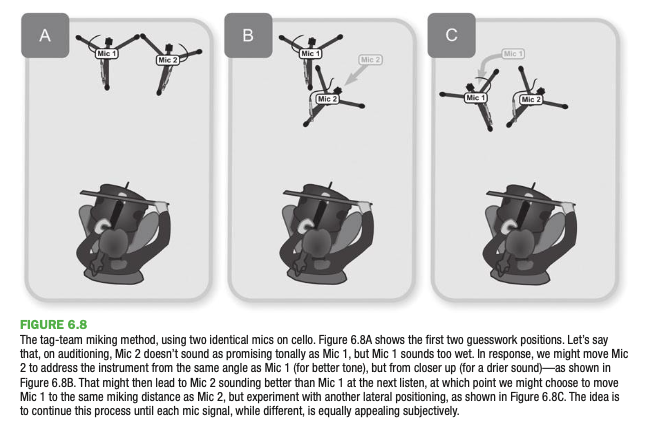

## Before placing the mic

One might think that the best thing to do would be to listen with your ears and put the mic where it sounds the best to your ears. But this won't work because mic's pickup sound differently than our ears do. This has to do with the polar patterns of the mics can be differnet from our ears, which hear in something similar to a subcardioid.

The different polar patterns will create a more dry or wet sound because they're picking up reflections that your ears might not be hearing.

> One solution to this is to compensate mentally: Supercardioid or hypercardioid mics will want to be roughly 50% more distant than your favored listening position to achieve a similar dry/wet balance, whereas cardioid or figure- eight mics need only be about 25% further away. Omnis, on the other hand, can usually afford to be about 25% closer in. (Mike Senior)

Why is this the case?

Mike suggests listening in two stages:

> 1. Find the head position which gives the most appropriate dry/wet balance, without getting too hung up on the quality of the rest of the sound.
> 2. Estimate what the actual miking distance should be (depending on the polar pattern of the mic you’re planning to use), move your head to this distance, and scout around there until you find a position where the instrument sounds its best while trying to ignore the fact that it’ll sound too dry/wet at that location.

Trick for cardiod mics:

> Where you’re using a cardioid mic, though, there’s a trick that can provide a shortcut here: Arrange your hands vertically just behind your ears, perpendicular to your line of sight, thereby blocking some of the sound from behind you and making your hearing a bit more cardioid.

Try closing your eyes to see if you can hear the sound better.

## Tonal adjustments at the source

- change the instrument
- change the playing implement
- change the tuning
- change the pressure/angle
- change the volume

## Positioning the mic

After our guess from listening in the recording room we need to make further adjustments by listening to the results.

If we have two of the same mics we can record them at the same time from different distances and compare the same performance.

